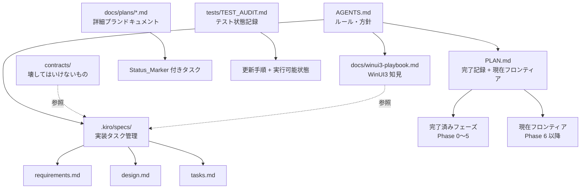

# 設計ドキュメント — スペック管理の整備

## 概要

本ドキュメントは `ghostty-win` リポジトリにおけるスペック管理の整備設計を定義します。

### 解決する問題

現状、以下の 4 つの問題が存在します。

1. **PLAN.md の混在**: Phase 0〜5 の完了記録と Phase 6 の未完了 TODO が同一ファイルに混在し、「今何をすべきか」が一目でわからない
2. **docs/plans/ の完了追跡なし**: 4 つのプランドキュメントにタスクの完了マークがなく、ソースコードを読まないと実装状態がわからない
3. **チャット記憶依存**: WinUI3 の知見がチャット記憶に留まり、`NON-NEGOTIABLES.md` のルールが構造的に守られていない
4. **テスト状態の陳腐化**: `tests/TEST_AUDIT.md` が 2026-03-27 のスナップショットのまま更新手順が定義されていない

### 設計方針

- **変更対象**: `PLAN.md`、`docs/plans/*.md`（4 ファイル）、`AGENTS.md`、`tests/TEST_AUDIT.md`
- **変更しないもの**: `contracts/`、`docs/winui3-playbook.md`、`docs/winui3-known-good-apis.md`、ソースコード
- 本スペック自体が「`.kiro/specs/` を権威ある単一ドキュメントとして確立する」実例となる

---

## アーキテクチャ

### ドキュメント体系の全体像



### 各ドキュメントの役割分担

| ドキュメント | 役割 | 更新タイミング |
|------------|------|--------------|
| `AGENTS.md` | ルール・方針・コマンドリファレンス | ルール変更時 |
| `PLAN.md` | 完了記録 + 現在の作業フロンティア | フェーズ完了時 |
| `.kiro/specs/` | 詳細スペック（要件・設計・タスク） | スペック作成・タスク完了時 |
| `docs/plans/*.md` | 実装詳細プラン + 完了追跡 | タスク完了時 |
| `tests/TEST_AUDIT.md` | テスト実行可能状態の記録 | テスト実行時 |
| `docs/winui3-playbook.md` | WinUI3 の知見・Durable Finding | 新知見発見時 |
| `contracts/` | 壊してはいけない COM/vtable 定義 | 変更しない |

---

## コンポーネントと変更仕様

### 1. PLAN.md の再構成

#### 現状の問題

```
# Ghostty Windows GUI 実装計画
## 方針
## ステップ
...（長大な実装詳細）
## 進捗
### Phase 0: 完了 (2026-03-02)
...
### Phase 6: 実機テスト — ユーザー操作待ち (2026-03-03)
- [ ] IME 日本語入力の実機確認
- [x] TabView の作成確認
...
```

完了済みフェーズと未完了タスクが同一の「進捗」セクションに混在しています。

#### 変更後の構造

```markdown
# Ghostty Windows GUI 実装計画

## 現在の作業フロンティア  ← 最上部に配置

| タスク | Status | 詳細 |
|--------|--------|------|
| Phase 6: 実機テスト | 進行中 | IME・TabView・リサイズ等の実機確認 |

## 完了済みフェーズ

### Phase 0: 手書き COM vtable で WinUI3 ウィンドウ表示 — Status: 完了 (2026-03-02)
...
### Phase 5: バグ修正・機能追加 — Status: 完了 (2026-03-03)
...

## 未完了タスク

### Phase 6: 実機テスト — Status: 進行中 (2026-03-03)
- [ ] IME 日本語入力の実機確認
- [x] TabView の作成確認
...

## 方針・背景（参考）
...（既存の方針セクションを末尾に移動）
```

#### 変更ルール

- 「現在の作業フロンティア」セクションを **ファイル先頭**（方針より前）に配置する
- 各フェーズヘッダーに `Status: 完了 | 進行中 | 未着手` ラベルを付与する
- 完了済みフェーズ（Phase 0〜5）は「完了済みフェーズ」セクションに集約する
- 未完了タスク（Phase 6）は「未完了タスク」セクションに分離する
- 方針・背景・ステップ詳細は末尾の「参考」セクションに移動する

---

### 2. docs/plans/*.md の完了追跡追加

#### 対象ファイルと現状

| ファイル | タスク数 | 現状 | 実装状態（調査結果） |
|---------|---------|------|-------------------|
| `2026-03-13-xaml-islands-migration.md` | 8 タスク | 完了マークなし | Task 3（island_window.zig）は実装済み |
| `2026-03-12-debug-perf-optimization.md` | 5 タスク | 完了マークなし | Task 1〜3 は実装済みの可能性あり |
| `2026-03-05-winui3-com-generator-requirements.md` | 要件定義（タスクなし） | — | 契約定義のみ、タスク形式でない |
| `2026-03-03-winui3-foundation-harness.md` | 3 タスク | 完了マークなし | 未確認 |

#### 変更後の構造（各 Plan_Doc）

各 Plan_Doc の先頭に以下のメタデータブロックを追加します。

```markdown
---
最終更新: 2026-XX-XX
完了: N/M タスク
---
```

各タスクヘッダーを以下の形式に変更します。

```markdown
## Task N: タスク名 [x]   ← 完了
## Task N: タスク名 [ ]   ← 未着手
## Task N: タスク名 [-]   ← 進行中
```

#### xaml-islands-migration.md の実装状態評価方法

`island_window.zig` の存在確認でタスク 3 の完了を判定します。
各タスクの完了判定基準：

| Task | 完了判定基準 |
|------|------------|
| Task 0: ビルドシステム登録 | `src/apprt/runtime.zig` に `winui3_islands` が存在する |
| Task 1: 共有コードコピー | `src/apprt/winui3_islands/` ディレクトリが存在する |
| Task 2: COM Interface 追加 | `com_native.zig` に `IDesktopWindowXamlSource` が存在する |
| Task 3: island_window.zig | `src/apprt/winui3_islands/island_window.zig` が存在する |
| Task 4: nonclient_island_window.zig | 対応ファイルが存在する |
| Task 5: App.zig | `src/apprt/winui3_islands/App.zig` が存在する |
| Task 6: Surface/tabview/drag_bar | 対応ファイルが存在する |
| Task 7: os.zig 追加 + コンパイル | ビルドが通る |

---

### 3. AGENTS.md へのスペック管理ルール追加

#### 追加するセクション

既存の `AGENTS.md` に「Spec Management」セクションを追加します。既存セクションは変更しません。

```markdown
## Spec Management

### 権威ある情報源

| 情報の種類 | 参照先 |
|-----------|--------|
| 次に実装すべきタスク | `.kiro/specs/` の `tasks.md` |
| 現在の作業フロンティア | `PLAN.md` の「現在の作業フロンティア」セクション |
| WinUI3 の知見・動作 | `docs/winui3-playbook.md`、`docs/winui3-known-good-apis.md` |
| 壊してはいけない定義 | `contracts/winui-contract.json`、`contracts/vtable_manifest.json` |
| テスト実行可能状態 | `tests/TEST_AUDIT.md` |

### スペック管理ルール

1. **新しい実装タスクは `.kiro/specs/` にスペックを作成してから着手する。**
   - `requirements.md` → `design.md` → `tasks.md` の順で作成する。
   - スペックなしで実装を開始してはならない。

2. **チャット記憶を WinUI3 の真実の源泉として使用してはならない。**
   - 根拠は `docs/winui3-playbook.md`、テストスクリプト、または GitHub Issue に記録すること。
   - 詳細は [NON-NEGOTIABLES.md](NON-NEGOTIABLES.md) を参照。

3. **PLAN.md と .kiro/specs/ の使い分け:**
   - `PLAN.md`: フェーズ単位の完了記録と現在の作業フロンティア（粗粒度）
   - `.kiro/specs/`: 個別機能の詳細要件・設計・タスク（細粒度）
   - 両者は補完関係であり、どちらか一方を廃止しない。

4. **新しい WinUI3 の知見を発見したとき:**
   - `docs/winui3-playbook.md` または `docs/winui3-known-good-apis.md` に追記する。
   - テストスクリプトで検証可能な知見はテストとして `tests/` に追加する。
```

---

### 4. tests/TEST_AUDIT.md の更新手順追加

#### 追加する内容

既存の `tests/TEST_AUDIT.md` に以下を追加します。

**先頭に更新日時と陳腐化警告ロジックの説明を追加:**

```markdown
# Test Audit Report — ghostty-win

最終更新: 2026-03-27
次回更新期限: 2026-04-26（30日後）

> **警告**: 最終更新から 30 日以上経過している場合、このドキュメントは陳腐化している可能性があります。
> 更新手順に従って状態を再確認してください。
```

**「更新手順」セクションを追加:**

```markdown
## 0. 更新手順

### 静的テストの実行と記録

```powershell
# self_diagnosis/ の静的テストを一括実行
Get-ChildItem tests/self_diagnosis/test_*.ps1 | ForEach-Object {
    $result = pwsh -File $_.FullName 2>&1
    $status = if ($LASTEXITCODE -eq 0) { "パス" } else { "フェイル" }
    Write-Host "$($_.Name): $status"
}
```

### 更新後の記録方法

1. 上記コマンドを実行する
2. 各テストの結果を「テスト一覧」の「現在の状態」列に記録する
3. 先頭の「最終更新」日付を更新する
4. 「推奨アクション」セクションを見直し、解決済みの問題を削除する
```

**各テスト行に「現在の状態」列を追加:**

既存のテーブルに `現在の状態` 列を追加します。

```markdown
| # | ファイル | 種別 | テスト対象 | 関連Issue | 現在の状態 |
|---|---------|------|-----------|----------|-----------|
| 1 | cursor_test.ps1 | 手動 | ... | — | 未実行（手動） |
```

---

## データモデル

### Status_Marker の定義

本スペックで使用する Status_Marker は以下の 3 値のみとします。

| マーカー | 意味 | 使用箇所 |
|---------|------|---------|
| `[x]` | 完了 | PLAN.md、docs/plans/*.md、tasks.md |
| `[ ]` | 未着手 | PLAN.md、docs/plans/*.md、tasks.md |
| `[-]` | 進行中 | PLAN.md、docs/plans/*.md、tasks.md |

### Plan_Doc メタデータスキーマ

```
---
最終更新: YYYY-MM-DD
完了: N/M タスク
---
```

- `最終更新`: ISO 8601 日付形式（YYYY-MM-DD）
- `完了`: `N/M` 形式（N = 完了タスク数、M = 全タスク数）

### PLAN.md セクション構造

```
# Ghostty Windows GUI 実装計画

## 現在の作業フロンティア    ← 必須、最上部
## 未完了タスク              ← 必須
## 完了済みフェーズ          ← 必須
## 方針・背景（参考）        ← 任意、末尾
```

---

## 正確性プロパティ

*プロパティとは、システムの全ての有効な実行において成立すべき特性または振る舞いのことです。プロパティは人間が読める仕様と機械検証可能な正確性保証の橋渡しをします。*

### Property 1: Plan_Doc の全タスクに Status_Marker が存在する

*For any* `docs/plans/` 以下のプランドキュメントにおいて、`## Task` で始まる全タスクヘッダーに `[x]`、`[ ]`、`[-]` のいずれかの Status_Marker が付与されていること。

**Validates: Requirements 2.1, 2.4**

---

### Property 2: Plan_Doc の先頭に完了サマリーが存在する

*For any* `docs/plans/` 以下のプランドキュメントにおいて、ファイル先頭のメタデータブロックに `完了: N/M` 形式のサマリーが存在すること。

**Validates: Requirements 2.3, 2.5**

---

### Property 3: 全スペックに 3 ドキュメントが揃っている

*For any* `.kiro/specs/` 以下のスペックディレクトリにおいて、`requirements.md`、`design.md`、`tasks.md` の 3 ファイルが存在すること。

**Validates: Requirements 4.2**

---

### Property 4: 全 tasks.md のタスク行に Status_Marker が存在する

*For any* `.kiro/specs/` 以下の `tasks.md` において、タスク行（`- [ ]`、`- [x]`、`- [-]` で始まる行）に Status_Marker が付与されていること。

**Validates: Requirements 4.6**

---

### Property 5: TEST_AUDIT.md の全テスト行に実行可能状態が記録されている

*For any* `tests/TEST_AUDIT.md` のテスト一覧テーブルにおいて、全テスト行に「現在の状態」列の値（パス / フェイル / 環境依存 / 未実行）が記録されていること。

**Validates: Requirements 5.3**

---

### Property 6: 30 日超過時に陳腐化警告が表示される

*For any* 日付において、`tests/TEST_AUDIT.md` の「最終更新」日付から 30 日以上経過している場合、ドキュメント先頭に警告メッセージが表示されること。

**Validates: Requirements 5.4**

---

## エラーハンドリング

### Status_Marker の不整合

**問題**: タスクが実装済みだが `[ ]` のままになっている。

**対処**: `tasks.md` の実行時に、完了したタスクの Status_Marker を `[x]` に更新することを必須とする。AGENTS.md にルールとして明記する。

### Plan_Doc の実装状態評価の不確実性

**問題**: `docs/plans/` のタスクが実装済みかどうかを、ファイルの存在確認だけでは判断できない場合がある。

**対処**: 判断できない場合は `[-]`（進行中）を使用し、コメントで不確実性を明記する。

```markdown
## Task N: タスク名 [-]
<!-- 実装状態不明: ファイルは存在するが動作未確認 -->
```

### TEST_AUDIT.md の陳腐化

**問題**: テスト環境（agent-deck のパス等）が変わり、テスト結果が変わる。

**対処**: 「現在の状態」列に環境依存の注記を追加できるようにする。

```
| test-02d-control-plane.ps1 | ... | 環境依存（agent-deck 要インストール） |
```

---

## テスト戦略

本スペックの変更対象はすべてドキュメントファイルです。ソースコードの変更はありません。

### 単体テスト（例示ベース）

以下の確認を `tasks.md` の各タスク完了時に実施します。

| 確認項目 | 方法 |
|---------|------|
| PLAN.md に「現在の作業フロンティア」セクションが最上部にある | ファイルを開いて目視確認 |
| PLAN.md の各フェーズに Status ラベルがある | 正規表現 `Status: (完了\|進行中\|未着手)` で検索 |
| docs/plans/*.md の先頭にメタデータブロックがある | 各ファイルの先頭 5 行を確認 |
| AGENTS.md に「Spec Management」セクションがある | ファイルを開いて目視確認 |
| TEST_AUDIT.md に「更新手順」セクションがある | ファイルを開いて目視確認 |

### プロパティベーステスト

本スペックは PBT が適用可能な領域を含みます。ただし対象がドキュメントファイルであるため、
プロパティテストは「ファイル構造の検証スクリプト」として実装します。

**検証スクリプト**: `scripts/validate-spec-docs.ps1`（tasks.md で作成）

```powershell
# Property 1: Plan_Doc の全タスクに Status_Marker が存在する
$planDocs = Get-ChildItem docs/plans/*.md
foreach ($doc in $planDocs) {
    $content = Get-Content $doc
    $taskLines = $content | Where-Object { $_ -match "^## Task \d+" }
    foreach ($line in $taskLines) {
        if ($line -notmatch "\[(x| |-)\]") {
            Write-Error "Status_Marker なし: $($doc.Name): $line"
            exit 1
        }
    }
}

# Property 3: 全スペックに 3 ドキュメントが揃っている
$specs = Get-ChildItem .kiro/specs/ -Directory
foreach ($spec in $specs) {
    $required = @("requirements.md", "design.md", "tasks.md")
    foreach ($file in $required) {
        if (-not (Test-Path "$($spec.FullName)/$file")) {
            Write-Error "ファイルなし: $($spec.Name)/$file"
            exit 1
        }
    }
}

Write-Host "全プロパティ検証: OK"
```

### 受け入れゲートとの関係

本スペックの変更（ドキュメント整備）はビルドゲートに影響しません。
変更後も以下がパスすることを確認します。

```powershell
zig build -Dapp-runtime=winui3 -Drenderer=d3d11
pwsh -File .\scripts\winui3-contract-check.ps1 -Build
```
